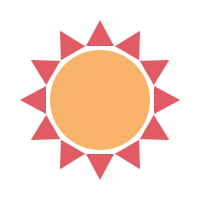

<h2> 𝐇𝐞𝐥𝐥𝐨 𝐭𝐡𝐞𝐫𝐞, 𝐟𝐞𝐥𝐥𝐨𝐰 <𝚍𝚎𝚟𝚎𝚕𝚘𝚙𝚎𝚛𝚜/>! </h2>

You have finally discovered my Github profile.  
Please feel free to clone/fork projects, raise issues and submit PRs if you think something could be better.  

</img>𝐻𝘢𝑝𝘱𝑦 𝑐𝘰𝑑𝘪𝑛𝘨! 

---
<i>Follow me around the web:</i> 

